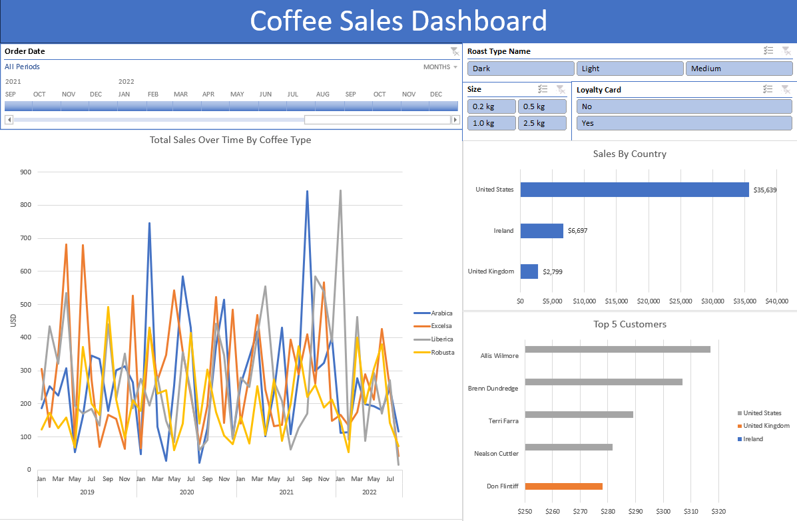

# Coffee-Sales-Analytics-Dashboard
## Problem Statement
Café Espresso Oasis is looking to enhance its business intelligence and decision-making capabilities by leveraging data analytics in their coffee sales operations. 
The company wants to develop a comprehensive Coffee Sales Analytics Dashboard that provides key insights into various aspects of their sales performance. 
The dashboard should encompass visualizations and interactive elements to empower stakeholders in making informed decisions.
## Objective
1.Sales Over Time: Develop a time-series visualization to showcase the total sales trends over a selected period, enabling the identification of peak sales times and potential areas for improvement.

2.Geographical Analysis: Implement a country-based visualization to display total sales by country, helping Café Espresso Oasis understand regional variations and target areas for potential growth.

3.Top Customer Analysis: Create visualizations to identify and showcase the top 5 customers based on their purchasing history, allowing the café to tailor promotions and engagement strategies for these key customers.

4.Interactive Slicers: Implement slicers for timeline selection, loyalty status (loyal vs. non-loyal customers), coffee bean size, and coffee type, providing users with the flexibility to analyze sales data based on specific criteria.

5.Loyalty Classification: Utilize data to categorize customers as loyal or non-loyal based on predefined criteria, enabling targeted marketing efforts towards retaining and growing the loyal customer base.

6.Coffee Type Impact: Analyze how the type of coffee affect sales, providing insights into product preferences and informing inventory management strategies.

### The successful completion of this project will empower Café Espresso Oasis with a powerful tool for data-driven decision-making, enabling them to optimize sales strategies, identify growth opportunities, and enhance overall business performance in the highly competitive coffee market.

